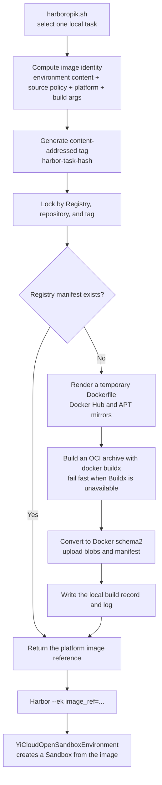

# OpenSandbox Task Image Management

## Summary

`opensandbox_image_manager.py` builds a local Harbor task's
`environment/Dockerfile`, publishes the result to the YiCloud Registry, and
returns a stable image reference to OpenSandbox. It neither creates a Sandbox
nor runs an agent.

`harboropik.sh` invokes the manager for a single task.
`prebuild_opensandbox_dataset.sh` invokes the same manager to prebuild an
entire local benchmark.

## Execution Flow



The integration entry point is
[`prepare_opensandbox_image_ref`](harboropik.sh). The main workflow
is implemented by [`prepare`](opensandbox_image_manager.py#L664-L780).

The OCI export explicitly disables Buildx provenance attestations. The
publisher accepts exactly one platform manifest and converts that manifest to
Docker schema2; an attestation manifest would make the archive ambiguous and
is therefore prevented at build time rather than silently discarded.

## Why an Unchanged Task Is Usually Built Once

The image identity covers:

```text
manager format version
+ environment/ content hash
+ Docker and APT source policy
+ target platform
+ explicit build arguments
```

Changing any component produces a new tag. Unchanged content resolves to the
same Registry manifest. Concurrent requests also acquire the same `flock`, so
only one process builds while the others wait and reuse the result. The
Registry manifest is authoritative for cache hits; local `records/*.json`
files contain audit metadata only.

## Registry and Sandbox Image References

| Name | Example | Purpose |
| --- | --- | --- |
| Registry reference | `registry.gate.yicloud.com.cn/project/repo:tag` | Target used by the manager when publishing |
| Sandbox reference | `project/repo:tag` | Value passed to YiCloud `CreateSandbox` |

Registry credentials are read from the Docker config. Build logs and records
do not store the username, password, or Sandbox access token.

## Current Boundaries

- One invocation handles one local task.
- The task must contain `environment/Dockerfile`. Compose tasks fail fast
  because multi-service execution is not implemented; building only the
  `main` service would not provide compatible behavior.
- Automatic image preparation does not handle Harbor registry datasets.
  Set `HARBOR_OPENSANDBOX_IMAGE_REF` explicitly to bypass the build.
- Configured domestic Docker and APT mirrors are preferred. Proxy build
  arguments are forwarded only when explicitly enabled.
- `--force` appends a timestamp to the tag and bypasses the normal
  content-addressed cache.
