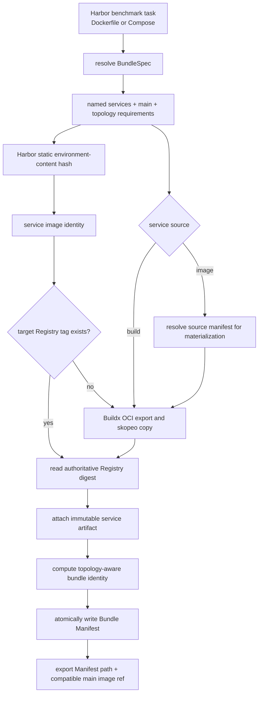

# OpenSandbox Bundle and Image Management

## Summary

The image layer represents every local Harbor benchmark framework task as a
versioned Bundle:

- `compose_bundle.py` normalizes a single Dockerfile into an implicit `main`
  service, or parses a Compose definition into named services and topology;
- `opensandbox_image_manager.py` prepares one content-addressed Registry image
  per distinct service image input and atomically writes the Bundle Manifest;
- `harboropik.sh` exports both the Manifest path and the legacy main image ref;
- `prebuild_opensandbox_dataset.sh` writes one Manifest per task while retaining
  resumable Registry cache behavior.

This layer does not create Sandbox instances, run health checks, or schedule
service dependencies. Those operations belong to the Environment runtime.

## Flow



The integration entry point is
[`prepare_opensandbox_image_ref`](harboropik.sh). The main workflow
is implemented by [`prepare`](opensandbox_image_manager.py).

## Input normalization

One code path handles both formats:

| Task definition | Normalized result |
| --- | --- |
| `environment/Dockerfile` | One implicit service named `main` |
| `environment/docker-compose.yaml` or `.yml` | Named services; a `main` service is required |

The restricted Compose loader currently supports `build.context`,
`build.dockerfile`, `build.args`, `build.target`, `image`, `entrypoint`,
`command`, `environment`, `ports`, `expose`, aliases, `depends_on`, `healthcheck`,
volumes, networks, `cap_add`, and `privileged`. Build paths are resolved and
must remain inside the task environment. Unsupported build fields fail before
any image is built.

The loader records requirements such as multiple services, shared volumes,
fixed IPs, multiple networks, capabilities, and privileged execution. Recording
a requirement does not imply that OpenSandbox can satisfy it; the runtime
capability gate is part of the separate scheduling implementation.

## Identity and cache contract

Service image identity and Bundle identity are intentionally separate. The
service identity follows the Harbor benchmark framework's whole static
environment-content identity;
the Bundle identity additionally captures resolved artifacts and runtime
topology.

For a built service, image identity covers:

```text
Harbor 0.18 environment-content hash of the original environment files
```

The manager requires and directly calls the Harbor benchmark framework's native
`harbor.environments.definition.environment_content_hash()` API. It fails at
startup when that API is unavailable; there is deliberately no local hash
fallback that could silently diverge after a Harbor runner upgrade.

Task-declared Compose build arguments and Dockerfile defaults are already part
of the static environment content. Runtime build-argument overrides, package
mirrors, APT mirrors, base-image transport mirrors, proxies, fallback choices,
build-network settings, target platform, renderer version, and APT runtime asset
digest do not participate in image identity. The implementation uses the Harbor
benchmark framework's complete SHA-256 result rather than a provider-specific
display truncation.

**P0 invariant:** image identity must come only from the original static task
environment. Treat any dependency on rendering, rewriting, mounts, mirrors,
runtime assets, resolved artifacts, or other build-time mutation as a P0 bug.

For an `image:` service, the original image reference declared by the task is
used only as the Harbor benchmark framework's empty-environment fallback seed.
A dynamically resolved
source manifest digest is retained as build evidence but does not change the
task identity. The image is republished through the managed Registry flow so
that OpenSandbox receives the materialized image's digest ref.

OCI Registry addressing is explicit:

```text
Project = benchmark
Repository = task identity (verbatim)
tag = <service>-<short-input-hash>
digest ref = <registry>/<project>/<task>@sha256:<artifact-digest>
```

The default repository name must exactly match the task directory name. The
image manager validates that it is already a legal OCI repository component;
it does not sanitize, truncate, or append a hash. Invalid task identities must
be fixed by the dataset adapter so that Registry publication never silently
changes task identity.

The `input_hash` is a full SHA-256 calculated before build and the Registry
`artifact_digest` is collected by an independent `skopeo inspect` after copy.
Normal on-demand preparation keeps the target task repository as cache
authority. Dataset prebuild additionally enables a persistent local
uploaded-Bundle index under
`<HARBOR_OPENSANDBOX_IMAGE_CACHE_ROOT>/uploaded-bundles/`. Entries are scoped by
Registry host, Project, benchmark, platform, and verbatim task repository.
They are written only after every service has resolved successfully through the
Registry path.

On a later prebuild, the default local-cache path parses the current Bundle and
compares its definition identity and every service's full static environment
hash before reusing the recorded immutable digest refs. This avoids Registry
login and manifest inspection. With
`HARBOR_OPENSANDBOX_PREBUILD_SKIP_HASH_VERIFICATION=1`, a structurally valid
entry matching the same target and task identity is trusted before task parsing
or content hashing. That mode deliberately does not prove that the dataset is
unchanged or that Registry retention has preserved the artifacts. Disable the
local path with `HARBOR_OPENSANDBOX_PREBUILD_USE_LOCAL_UPLOAD_CACHE=0`, remove
the relevant local entry, or use the manager's `--force` option when Registry
revalidation/rebuild is required.

Each Compose service has an independent service tag and artifact resolution.
The manager does not implement Registry Project management, raw blob upload,
an old-Registry fallback, or a cross-repository layer index.

The current context hash is conservative: generated cache files are ignored,
but `.dockerignore` is not yet evaluated. This can cause an unnecessary rebuild
when an ignored file changes, but cannot incorrectly reuse a stale image.

## Bundle Manifest contract

The JSON Manifest includes:

- schema v2 `benchmark`, `task_identity`, and `registry` metadata;
- stable definition and Bundle identities;
- `main` and all named service records;
- full `input_hash`, tag/tag ref, Artifact digest, and digest ref;
- image config (`Entrypoint`, `Cmd`, `ExposedPorts`, healthcheck), Compose
  override presence, environment, ports/expose, aliases, dependency and
  healthcheck topology;
- materialized `runtime.start_argv`, `runtime.internal_ports`, and
  `runtime.readiness`, each with an auditable source where applicable.
- volume, network, capability, and unsupported-feature requirements.

Build argument values are not written to the Manifest or local record. The
Manifest records only their names. Effective transport-only build arguments are
also not persisted. Credentials come from the ignored
`YICLOUD_HARBOR_USERNAME`/`YICLOUD_HARBOR_PASSWORD` environment or an existing
Docker config fallback and are never written to Bundle files. Sandbox tokens
and model credentials are outside this layer.

The optional `HARBOR_OPENSANDBOX_PUB_HOSTED_URL` and
`HARBOR_OPENSANDBOX_JULIA_PKG_SERVER` settings accept any build-reachable,
query-free HTTP(S) package service. They are injected as the ecosystem-native
`PUB_HOSTED_URL` and `JULIA_PKG_SERVER` build arguments, respectively. This is
provider-neutral: either setting may point to a trusted third-party mirror or a
cache gateway. Leaving it empty preserves the ecosystem's own default.

When `HARBOR_OPENSANDBOX_GITHUB_MIRROR_URL` names a GitHub Smart HTTP mirror
prefix, the manager injects transient Git
`url.*.insteadOf` entries through a BuildKit secret mounted as `/etc/gitconfig`
for Dockerfile `RUN` commands. They apply to ordinary clone/fetch and recursive
GitHub submodules, including HTTPS, SCP-like SSH, `ssh://`, and `git://` URLs.
The mount exists only while each `RUN` executes, so it is not written into an
image layer, image environment, or global `.gitconfig`.

## APT build-runtime interception

APT routing uses runtime interception. After official semantic lowering, the
OpenSandbox frontend gives each Dockerfile `RUN` the same BuildKit-only mounts
and execution environment:

```text
/run/opensandbox-apt/bin/apt
/run/opensandbox-apt/bin/apt-get
PATH=/run/opensandbox-apt/bin:$PATH
```

The [OpenSandbox BuildKit instrumentation frontend](opensandbox_buildkit_frontend/README.md)
adds these options to every RUN ExecOp after official Dockerfile semantic
lowering. Shell, JSON exec, heredoc (including shebang), custom SHELL and RUN
options use the same hook; argv is unchanged. The frontend provides APT mounts
and the execution-time PATH directly as RunOptions.

The wrappers, source rewriter and source map are required BuildKit secrets;
the invocation workspace is tmpfs. Effective PATH is read from the frontend's
stage state and prepended only as a RunOption. Neither runtime files nor PATH
persist in image layers/config or subsequent stage environment expansion.
The independent Git `/etc/gitconfig` mount and existing URL/package redirects
retain their current implementation.

Orchestration looks for a verified, source-addressed frontend in the local OCI
cache (`HARBOR_OPENSANDBOX_FRONTEND_CACHE`). Missing or corrupt entries are built
on the calling host through the Gateway; no frontend image is pulled or pushed.
Buildx receives the local OCI layout as a named context and selects it using
BUILDKIT_SYNTAX. It leaves the task source unchanged but takes precedence over
the dataset syntax directive; custom frontends or syntax beyond the pinned
version require a separate compatibility assessment. A cold cache needs Git,
GNU timeout, Go on PATH or in the project-managed tools directory, Docker/buildx
and the explicit ARTIFACT_CACHE_GATEWAY_URL setting. Runtime
assets and source maps use content-addressed secret IDs; an additional frontend
identity secret commits the frontend digest to every RUN cache key. All four changes invalidate BuildKit
RUN cache when a build is performed. The existing static task Registry identity
is unchanged; use `--force` for rollout to already published task inputs.

A shared frontend preparation failure returns exit code 78. The dataset prebuild
launcher stops dispatching further tasks and records a run-scoped failure marker
so waiting workers do not repeat the same failed build. Repair the prerequisites
and start a new non-force batch to resume; cached task images remain reusable.

Each time `apt` or `apt-get` is found through `PATH`, the wrapper reads the
current rootfs copies of `/etc/apt/sources.list`, `*.list`, and `*.sources`. It
copies them into an invocation-local shadow tree, rewrites active source URIs,
and invokes the current rootfs binary at `/usr/bin/apt` or `/usr/bin/apt-get`
with `Dir::Etc::SourceList` and `Dir::Etc::SourceParts` pointing at that shadow.
The real `/etc/apt` files are never changed. Updating the `apt` package during a
build therefore naturally changes the real binary used by later invocations.

After a successful `apt update` or `apt-get update`, the same invocation asks
APT for rewritten-source and original-source index targets with `apt-get
indextargets`. It joins targets by their stable source-entry and target metadata,
then copies the downloaded target and any compressed variants to the filename
APT derives from the original URI. Corresponding `InRelease`, `Release`, and
`Release.gpg` files are reconciled as well. The gateway-named files remain in
place for later intercepted commands in the same build. If target discovery or
copying fails, the wrapper emits `event=index-reconciliation-failed` and fails
the invocation instead of silently leaving an identity-mismatched image. This
runs only after a successful update and needs no stage analysis or final cleanup
RUN.

The mapping combines the configured distro mirror with
`HARBOR_OPENSANDBOX_APT_SOURCE_OVERRIDES_JSON`. Repository matches use the
longest prefix, retain the suffix, and require an exact match or `/` boundary.
An unmatched active HTTP(S) URI remains unchanged, but the wrapper emits a
structured warning before real APT starts. The reported `source=` value strips
any userinfo, query, and fragment so embedded credentials never reach build
logs; matching, rewriting, and downloads keep using the original URI:

```text
[opensandbox apt] WARNING event=unmapped-source source=<uri> file=<source-file>
```

Non-HTTP(S) sources such as `file:` and `cdrom:` remain unchanged without a
warning. Interception covers ordinary `apt` and `apt-get` lookup from every RUN
form, including JSON exec, nested `sh`/`bash`, dynamically downloaded scripts, and
subprocesses that inherit the build `PATH`. It intentionally does not intercept
`/usr/bin/apt`, `/usr/bin/apt-get`, explicit PATH resets, `env -i`, other
explicit paths, or custom libapt frontends. `APT_CONFIG` and explicit custom APT
source or config-root options are passed directly to the real binary with a
warning.
There is no `/usr/bin` overlay, apt-binary copy, base-stage snapshot, bind mount,
or stage-level restore/virtualization fallback.

`SkopeoPublisher` removes ambient HTTP(S) proxy variables for login, copy, and
inspect. TLS verification is controlled by `YICLOUD_HARBOR_TLS_VERIFY`; the
currently verified internal ingress requires `0`, but this is configuration,
not a global default for all registries.

Each publisher owns a private temporary `skopeo` authfile. Parallel prebuild
workers must never share the XDG runtime authfile, because concurrent `skopeo
login` writes can corrupt it. The private authfile is removed after publishing.

For local builds the manager reads the OCI archive config blob before the
temporary archive is discarded. Cache hits and external `image:` services use
`skopeo inspect --config`. It never derives runtime ports or default commands
by scanning Dockerfile text.

## CLI and compatibility

The normal integration calls:

```text
opensandbox_image_manager.py ... \
  --bundle-manifest-output <task-job>/<attempt>/opensandbox-bundle.json
```

Stdout defaults to the `main` image ref for existing callers. `--output
bundle-manifest` and `--output json` expose the new contracts directly.

`harboropik.sh` sets:

```text
HARBOR_OPENSANDBOX_BUNDLE_MANIFEST=<absolute path>
HARBOR_OPENSANDBOX_IMAGE_REF=<main digest_ref>
```

An explicitly supplied Bundle takes precedence and can supply the main ref. An
explicit image ref without a Bundle retains the old single-image behavior.
Both forms must use fully qualified image references under the configured
`YICLOUD_HARBOR_HOST`; the provider rejects bare references and other registries
before creating a Sandbox.

## Prebuild cache cleanup

Dataset prebuild bounds local BuildKit cache growth. It runs one
non-`--all` `docker buildx prune` before the batch and repeats it every 30
minutes by default. Configure the interval, maximum cache size, minimum free
space, and reserved cache space with:

```bash
HARBOR_OPENSANDBOX_PREBUILD_GC_INTERVAL_SEC=1800
HARBOR_OPENSANDBOX_PREBUILD_GC_MAX_USED_SPACE=500GB
HARBOR_OPENSANDBOX_PREBUILD_GC_MIN_FREE_SPACE=300GB
HARBOR_OPENSANDBOX_PREBUILD_GC_RESERVED_SPACE=100GB
```

The initial prune always runs for a non-dry-run batch. Set the interval to `0`
to disable only periodic GC after that initial prune. GC failures are logged
without aborting the batch. Detailed prune output is written to the run's
`buildkit-gc.log`. Images, containers, volumes, and OCI Registry artifacts are
outside this cleanup.

## Prebuild cache cleanup

Dataset prebuild bounds local BuildKit cache growth. It runs one
non-`--all` `docker buildx prune` before the batch and repeats it every 30
minutes by default. Configure the interval, maximum cache size, minimum free
space, and reserved cache space with:

```bash
HARBOR_OPENSANDBOX_PREBUILD_GC_INTERVAL_SEC=1800
HARBOR_OPENSANDBOX_PREBUILD_GC_MAX_USED_SPACE=500GB
HARBOR_OPENSANDBOX_PREBUILD_GC_MIN_FREE_SPACE=300GB
HARBOR_OPENSANDBOX_PREBUILD_GC_RESERVED_SPACE=100GB
```

Set the interval to `0` to disable GC. GC failures are logged without aborting
the batch. Detailed prune output is written to the run's `buildkit-gc.log`.
Images, containers, volumes, and OCI Registry artifacts are outside this
cleanup.

## Current boundary

- Image preparation and Bundle handoff are implemented for local tasks.
- `YiCloudOpenSandboxEnvironment` consumes schema v2 (and reads schema v1 for
  migration): it gates unsupported capabilities before creation, creates the
  service group, wires a managed `/etc/hosts` block, checks healthchecks, and
  routes the Harbor benchmark framework's default file and exec operations to
  `main`.
- `service_exec(name, ...)` and `stop_service(name)` target an explicit
  sidecar. Group startup failure and `stop(delete=True)` clean up all recorded
  Sandbox IDs.
- The parser is a deliberately restricted PyYAML loader, not a complete Docker
  Compose implementation. Compose merge, profiles, configs, secrets, and other
  unlisted semantics must be added or rejected explicitly before relying on
  them.
- Configured domestic Docker and APT mirrors are preferred. Proxy build args
  are forwarded only when explicitly enabled.
- `--force` bypasses the target-tag cache lookup; it does not change the
  deterministic tag or the image content identity. It also bypasses the local
  uploaded-Bundle index.
