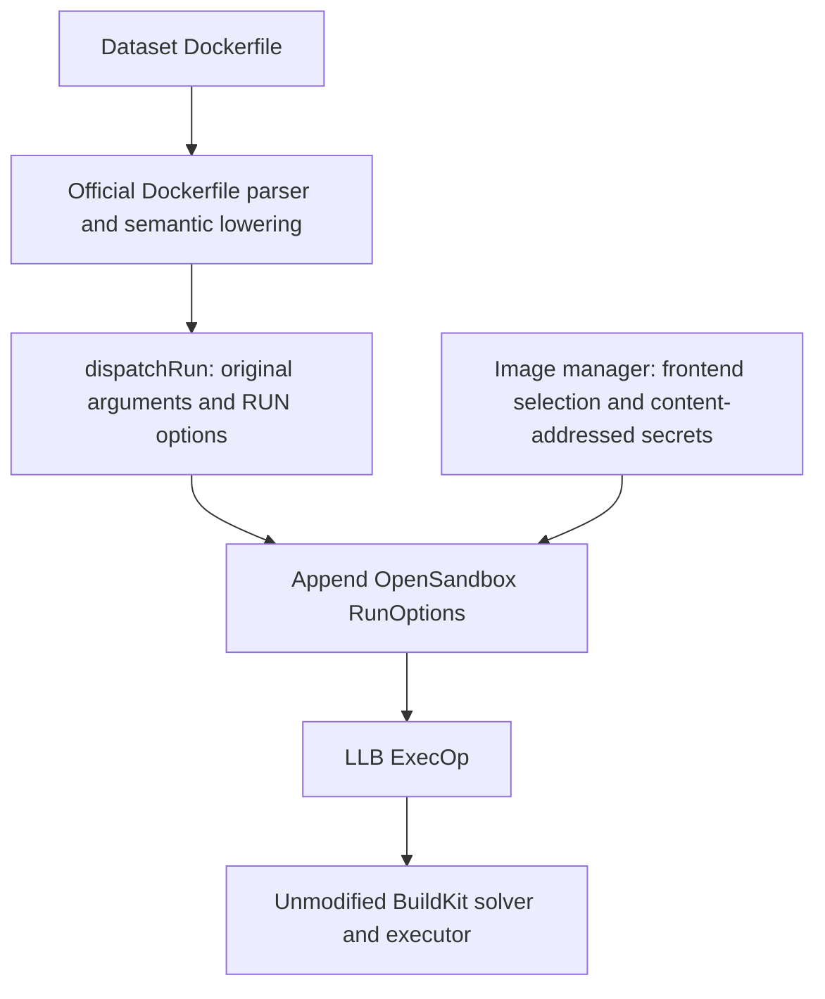

# OpenSandbox BuildKit instrumentation frontend

This component builds the official Dockerfile frontend with one lowering hook.
It targets Linux dataset builds. APT is its first runtime consumer. It does not
parse Dockerfile, inspect commands, or rewrite serialized LLB graphs.



## Architecture and upstream coupling

`upstream.version` pins BuildKit **v0.26.2**, commit
`be1f38efe73c6a93cc429a0488ad6e1db663398c`. The source is downloaded from the
platform Gateway when the calling host first needs an uncached frontend.
The repository contains neither a BuildKit source copy nor a parser fork.

Upstream entry:
`frontend/dockerfile/cmd/dockerfile-frontend/main.go` calls
`grpcclient.RunFromEnvironment(..., dockerfile.Build)`.
`frontend/dockerfile/builder/build.go` delegates conversion to
`frontend/dockerfile/dockerfile2llb/convert.go`.
The only changed upstream file is `convert.go`: five added lines immediately
before `d.state.Run(opt...).Root()` in `dispatchRun`.
`instrumentation.go` is copied into that package as `opensandbox.go` at build time.

Shell form, JSON exec form, continuations, heredocs (including shebangs),
custom `SHELL`, network, security, device and filesystem options have already
been lowered by upstream at this point. The helper never reads `Args`.
`llb.State.Run` builds its ExecOp from the option-adjusted state but returns
the original state's metadata with the new root output. Therefore a RunOption
`llb.AddEnv` preserves subsequent `ENV` expansion, inherited stage PATH, and
final image configuration. PATH comes from `state.GetEnv`, including base
image environment, per-stage ENV/ARG and upstream default PATH semantics.

Every RUN receives:

| Runtime target | LLB option |
| --- | --- |
| `PATH` | Prepend `/run/opensandbox-apt/bin:` to effective PATH |
| `/run/opensandbox-apt/bin/apt` and `apt-get` | Required wrapper secret, mode 0555 |
| `/run/opensandbox-apt/source-rewriter.awk` | Required rewriter secret, mode 0444 |
| `/run/opensandbox-apt/source-map` | Required source-map secret, mode 0444 |
| `/run/opensandbox-apt/frontend-identity` | Required public identity secret, mode 0444 |
| `/run/opensandbox-apt/shadow` | tmpfs |

The additional identity file commits the frontend OCI digest to every RUN's
cache key without adding environment or command arguments. Secret contents
alone do not invalidate BuildKit cache; wrapper/rewriter/source-map IDs are
content-addressed, and frontend identity derives from the digest-pinned image
digest (independent of the local cache path). These files are build-only. Original user, workdir, argv, network,
security, existing mounts and non-PATH environment remain upstream-owned.

## Local selection and construction

The frontend image is a build tool: BuildKit runs its Dockerfile compiler to
produce LLB. It is not a task base image and contributes no layers to task images.
BuildKit's external frontend interface consumes an OCI rootfs with an entrypoint,
so the static compiler is packaged in a small `scratch` image. The official
frontend capability labels allow it to consume named contexts; its own network
is disabled. Dataset RUN network semantics are unchanged.

`prepare_frontend` first checks the local OCI cache, keyed by the pinned upstream,
Go hook, patch, packaging/build script and host architecture. It verifies all OCI
blob digests before reuse. Missing or corrupt entries are rebuilt on this host;
a per-key file lock serializes concurrent first builds. No frontend registry
reference, registry lookup, Docker load or push is involved.

The cache defaults to `/data/harbor-runs/opensandbox-frontend`, alongside the
image manager’s existing local data directories. Override it with
`HARBOR_OPENSANDBOX_FRONTEND_CACHE`; on YiCloud keep it on local `/data` storage.
Each entry contains its source/toolchain work and `layout/`; the adjacent
`<source-key>.log` records cold-build progress. Git and Go have 600-second timeouts,
OCI packaging 180 seconds, and each compiler subprocess is bounded to 1500 seconds.
The prebuild launcher scopes a failure marker to its run directory. A shared
frontend preparation failure returns manager exit code 78; the launcher stops
dispatching tasks, and waiting workers do not repeat that failed preparation.
A new batch may retry after the prerequisites are repaired. This remains lazy:
fully cached task batches do not prepare the frontend or require Go/Gateway.
Keep caches on local storage. Remove an entry only when no build is using it;
the next call rebuilds it automatically.

Buildx receives `--build-context <frontend-name>=oci-layout:///<local-path>@sha256:<digest>`
and `--build-arg BUILDKIT_SYNTAX=<frontend-name>`. The client supplies the OCI
content to BuildKit over its session. Upstream checks this argument before the
Dockerfile syntax directive, so datasets need no frontend-specific edits. This
also overrides custom frontend selection; compatibility with custom frontends
or syntax beyond the pinned version is not established.
Only the OCI digest enters the frontend identity secret; moving the cache does
not change RUN cache keys. See the [Buildx build reference](https://docs.docker.com/reference/cli/docker/buildx/build/#build-context).

A warm cache needs only Docker/buildx in addition to the Python manager. A cold
cache additionally needs Git, GNU timeout, `ARTIFACT_CACHE_GATEWAY_URL`, and Go
1.25.4 on PATH or in the project-managed tools directory
(`AGENT_FLEET_BIN_DIR`, default `${XDG_DATA_HOME:-~/.local/share}/agent-fleet/bin`).
APT/Git source settings do not implicitly define the canonical Gateway root.
Setup provisions and validates Go 1.25.4 through the Gateway (see
[build-tool setup](../../../../../scripts/README.md#opensandbox-frontend-build-tools)).
Cold builds prefer the matching managed compiler over an older PATH entry and
use `GOTOOLCHAIN=local`; no compiler installation occurs during a task build.
Upstream vendored Go dependencies are used unchanged.
The pinned epoch and `rewrite-timestamp=true` keep OCI packaging reproducible.

To warm the same cache before task builds, run from the repository root:

```bash
export ARTIFACT_CACHE_GATEWAY_URL='<platform Gateway /v1/cache URL>'
export HARBOR_OPENSANDBOX_FRONTEND_CACHE='/data/<frontend-cache>'
PYTHONPATH=Agents/utils/common/Harbor python3 -c \
  'from opensandbox_buildkit_frontend import ensure_frontend; print(ensure_frontend())'
```

YiCloud development host, 2026-09-10: buildx 0.30.1 / BuildKit v0.26.2 docker
driver successfully consumed the local OCI frontend without builder changes.
Dedicated prebuild host execution remains a separate validation boundary.

## Runtime contract

The existing `../opensandbox_apt_runtime/apt-wrapper.sh` and
`source-rewriter.awk` own source mapping, warnings, invocation-local shadow
sources, real `/usr/bin/apt{,-get}`, and index reconciliation. The source map
continues to use `HARBOR_OPENSANDBOX_APT_SOURCE_OVERRIDES_JSON`.

Normal inherited PATH lookup of `apt` or `apt-get` is intercepted, including
child shells, Python subprocesses and generated/downloaded scripts. Explicit
`/usr/bin/apt-get`, PATH resets, `env -i`, direct `execve`, libapt, python-apt,
aptitude and nala may bypass interception. No binary overlay, rename, snapshot,
syscall interception or additional package-manager support is provided.
Non-root RUNs retain their original privileges; instrumentation grants none.
The APT wrapper requires `/bin/bash` in each task stage that invokes it and
uses `set -euo pipefail`. Preparation/reconciliation failures are checked
explicitly, and conditional APT execution preserves the real APT exit status.
Stages without Bash cannot invoke the wrapper; instrumentation does not install
Bash into task images.

Task registry identity continues to follow the existing static-task contract.
Frontend/runtime identities invalidate **BuildKit RUN cache when a build is
performed**, not the existing immutable task registry lookup. Use the existing
`--force` rebuild workflow when rolling out changed build instrumentation to
already published task inputs; `--no-cache` is unnecessary for identity changes.

## Validation and upgrade

`tests/corpus.py` is the shared table-driven source corpus. Its bounded products
combine calls and shell control structures; additional cases exercise JSON
escapes/continuations, heredocs, shebangs, custom SHELL, options, environments,
dynamic HTTP scripts and stages. Upstream parses every fixture.

`tests/lowering_test.go` runs in both pristine and patched source checkouts.
`tests/compare_lowering.py` compares decoded ExecOps and image config, allowing
only the prescribed PATH and mounts (environment entry order is irrelevant).
It does not alter an LLB DAG. `tests/cache_test.go` runs only in the patched
checkout and verifies stable terminal input digests plus separate invalidation
for wrapper, rewriter, map and frontend IDs.

`tests/integration.py` executes the corpus with both stock and patched frontend
images. It checks arguments, interpreter assertions, runtime routing, user,
cwd, HOME, PATH, exit status, full image config and every OCI layer for pollution.
The fake real-APT binary is strictly a test fixture. `tests/real_apt.py` instead
uses actual APT against an in-container flat HTTP repository with network=none,
source checksums and subsequent original-source `apt-cache policy` assertions.
Security/device executor cases explicitly request entitlements and run when
supported; daemon policy/capability denials are reported as conditional skips.
Their lowering remains compared even when execution is denied.

```bash
python tests/integration.py --output '/data/<test-output>' \
  --base '<internal-test-base>@sha256:<digest>' \
  --stock 'oci-layout:///<local-stock-layout>@sha256:<digest>'
python tests/real_apt.py --output '/data/<apt-test-output>' \
  --base '<internal-test-base>@sha256:<digest>'
```

Use the configured Harbor runner Python for these commands. Each build has a
120-second timeout (180 seconds for real APT), with one case at a time. Results
and build logs stay in the output directory.

To upgrade: change the tag and commit together; read upstream `dispatchRun`,
`State.Run`, secret/tmpfs options and frontend forwarding changes; reapply the
five-line hook; compile with the pinned toolchain; run stock/patched lowering,
cache and executor suites. The changed source key triggers local construction
with a new OCI digest automatically.
Expected maintenance is one hook plus the small helper's LLB API calls. If this
requires multiple semantic-state hooks, graph digest rewriting or daemon
changes, stop and repeat the architecture assessment.
