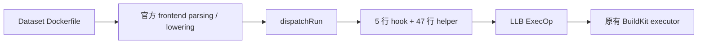

# 实施与验证报告

平台：YiCloud 开发机，Docker driver，linux/amd64。日期：2026-09-10。
结论：**Go，已完成 thin frontend、本机 OCI 缓存与缺失自动构建、编排接入与 APT 文本注入删除。**
相对 main 基线 `5a555fc` 的变化是新增 runtime wrapper 与 frontend 注入，替换静态 APT 源改写流程。
结构和复现命令见 [README](README.md)，逐例结果见 [verification.json](verification.json)。

| 项目 | 实施结果与证据 |
| --- | --- |
| 1. BuildKit pin | v0.26.2，`be1f38efe73c6a93cc429a0488ad6e1db663398c`；开发机与专用 prebuild 主机实际 builder 均为 v0.26.2，buildx 均为 0.30.1。 |
| 2. 官方入口 | `frontend/dockerfile/cmd/dockerfile-frontend/main.go` → `grpcclient.RunFromEnvironment(..., dockerfile.Build)` → `frontend/dockerfile/builder/build.go`。 |
| 3. RUN lowering 收敛点 | `frontend/dockerfile/dockerfile2llb/convert.go:dispatchRun`。 |
| 4. 插入位置 | 所有原有 options 构建完成后、`d.state.Run(opt...).Root()` 之前追加 RunOptions。 |
| 5. upstream 文件 | 只修改既有 `convert.go`；构建时新增 `dockerfile2llb/opensandbox.go`，内容来自仓库独立的 `instrumentation.go`。 |
| 6. upstream-coupled LOC | 对既有 upstream 文件增加 **5 行**；加上自有 helper，共 **52 行 downstream Go delta**。没有 parser、DAG rewrite 或 daemon 补丁。 |
| 7. 自有代码 LOC | Go helper **47 行**，Python 本机构建与编排契约 **133 行**，本机构建脚本 **49 行**，lowering 测试脚本 **30 行**。包含空行/注释；测试 corpus 和断言代码另计。 |
| 8. OCI 构建 | Gateway 获取固定源码；Go 1.25.4、vendor、CGO=0、trimpath；scratch 打包；固定 epoch，OCI `rewrite-timestamp=true`，输出本地 OCI layout，不 load/push；两次无缓存打包 manifest digest 相同。 |
| 9. buildx 选择 | `_prepare_service_image` 调用 `prepare_frontend`，用 `--build-context` 传本地 OCI layout，并通过既有 build-arg 环境传递 `BUILDKIT_SYNTAX`。官方入口优先检查此参数，覆盖 dataset syntax directive；dataset 无需声明 frontend。 |
| 10. builder 配置 | 无变化；未修改 buildkitd、Docker daemon 或 builder policy。security.insecure 被当前 daemon 明确拒绝，保留条件跳过。 |
| 11. ExecOp 增量 | 一项 PATH prepend；5 个 required secret targets（apt、apt-get、AWK、map、frontend identity）和 1 个 shadow tmpfs。wrapper 0555，其余文件 0444。 |
| 12. 语法统一依据 | shell/JSON/heredoc/shebang/custom SHELL/options 都由 upstream 先完成 lowering。helper 不读取 Args，不识别 APT 命令；State.GetEnv 提供 effective PATH；RunOption 不改变下一条指令的 state metadata/image config。 |
| 13. Python 删除内容 | 删除 main 中的 `run_invokes_apt`、`dockerfile_apt_stages`、`apt_mirror_command`、`apt_mirror_cleanup_command`、`append_apt_mirror_cleanup` 和 `append_apt_mirror_refresh` 等静态 APT 分析、源改写与恢复逻辑。Git mount 与 curl/wget overrides 的 RUN 文本辅助逻辑保留。 |
| 14. bypass contract | 正常继承 PATH 查找 apt/apt-get 会拦截；绝对 `/usr/bin/apt{,-get}`、PATH reset、env -i、直接 execve、libapt/python-apt/aptitude/nala 均允许 bypass。 |
| 15. syntax corpus | 81 个源 fixture：36 个组合 shell 案例及 45 个 JSON、continuation、heredoc、options、动态脚本、环境和 stage 案例。完整名称/结果列在 verification.json；源文本见 tests/corpus.py。 |
| 16. differential | **81/81 lowering 对照通过**；实际 executor **80 通过，1 条件跳过**。比较原始 ExecOp 字段、argv、解释器断言、USER/CWD/HOME/PATH、退出码、image config；仅允许指定 runtime 增量，环境数组顺序不作为语义。 |
| 17. real APT | flat loopback HTTP repo，BuildKit network=none；真实 update 成功、源 checksum 不变、original-source identity 的 apt-cache policy 可用。dists-style 真实仓库本次未验证；Deb822/list 重写沿用现有回归。 |
| 18. image pollution | corpus 每次成功导出的所有 OCI 层及完整 image config 均检查 runtime 路径/文件和 PATH 污染；scratch、真实 APT 亦通过。编译器不进入 task image。 |
| 19. cache invalidation | Go 检查 LLB terminal input digest；Python 检查内容寻址与 frontend pin；实际 solver 6 次构建确认同 identity 复用 nonce，wrapper/rewriter/map/frontend identity 分别变化时生成新 nonce，不依赖 secret contents 自动失效。 |
| 20. upstream 升级成本 | 重读一个 dispatchRun 调用点及 llb.RunOption API，rebase 5 行 hook 与 47 行 helper，运行同 pin 的 stock/patched 对照；新的源码 cache key 自动触发本机重建。若出现多点语义状态或 graph digest 改写，重新做 Go/No-Go。 |

## 本机 frontend

frontend 是新增的本机构建工具，通过 OCI layout named context 交给 BuildKit。
本机源码缓存缺失时通过 Gateway 构建，第二次调用直接复用；无 Go/Gateway 环境下的
缓存命中也已实测通过。Python 回归另验证了损坏 blob 自动重建和缓存搬迁不改变 identity。
本机 OCI digest：`sha256:1ee8b4fe64383ce7ab3965c096216d798297ecee9332ddfd6917ae1251acf645`。
该值只记录验证结果，不是运行配置。两次 `--no-cache` 打包 digest 相同。

封装补齐 upstream 的 frontend capabilities 和 network.none 标签。构建日志中的
`OCI load from client` 确认从客户端读取；日志把 named context 显示成 `docker.io/library/...`
是 upstream 的名称规范化，不是从 Docker Hub 下载 frontend。

OCI config 确认为 linux/amd64；创建时间固定为 upstream commit epoch
`2025-11-20T11:38:53Z`。Dockerfile security/device 使用 upstream 自带的
`dfrunsecurity,dfrundevice` build tags；stock 对照使用完全相同 tags 和 commit。
device 案例验证 optional、缺席 CDI device 的语义，不代表实际硬件设备透传已验证。

新增 APT wrapper/AWK 提供调用时的源视图与索引协调。Git mirror、curl/wget overrides、PyPI/NPM/Go/Cargo
redirect 保留既有实现，镜像管理器回归 **68/68 通过**（启用两项真实 APT 集成）。
另外七个 frontend 契约测试通过，其中一个逐例证明既有 renderer 不改变全部 81 个
corpus 源文本。Ruff 0.16.0、shell syntax、git diff whitespace 检查通过。

额外 `test_harboropik_opensandbox.sh` 在第 341 行的 **Docker/opencode verifier
mount JSON** 断言失败；现有记录没有建立与 main 的直接对照归因，不宣称全部 launcher
回归通过。完整 executor suite 运行在开发机；专用 prebuild 主机另完成下述正式入口验证；未创建 Sandbox，也不据此宣称真实 Agent、verifier 或模型链路通过。

静态 task Registry identity 保持既有契约。上述失效是 BuildKit RUN cache 的失效；
对已发布 task 输入推广新的 instrumentation，使用现有 `--force` 触发重建。

## 运行证据

本次原始日志与 OCI 产物位于 `/data/opensandbox-frontend-spike`：

| 证据 | 路径 |
| --- | --- |
| upstream/patched lowering | `stock-lowering.log`、`buildkit-lowering.log`；缓存断言最终结果为 `cache.log` |
| executor corpus | `local-integration/results.json`；逐例目录中的 stock/patched.log |
| 真实 APT、scratch | `local-real-apt/build.log`、`local-minimal/{stock,patched}.log` |
| 实际 solver cache | `local-solver-cache/results.json`、各 identity 的 build.log |
| 镜像管理器真实回归 | `/tmp/frontend-local-manager-tests.log` |
| 本机构建、缓存与可复现打包 | `/tmp/frontend-local-cache-test.log`、`/data/opensandbox-frontend-local-cache/<source-key>.log`、`/tmp/frontend-local-repeat.log` |
| launcher 基线问题 | `baseline-launcher.log`；当前分支日志 `/tmp/frontend-harboropik-tests.log` |

测试 HTTP 服务均由 RUN 的 EXIT trap 清理；frontend 本机构建不额外启动持久容器。没有 daemon/policy
改动需要撤回。保留隔离源码缓存、测试 OCI 和日志便于审查；未把运行产物放入源码目录。

## 专用 prebuild 主机的正式入口验证

2026-09-10，YiCloud 专用 prebuild 主机：通过 `prebuild_opensandbox_dataset.sh`、
tmux、并发 1、非 force 路径运行真实 `pyfar__pyfar-114`。冷缓存从 Gateway 获取固定
源码、用项目工具目录内的 Go 1.25.4 构建本地 frontend；真实 APT update/install
libsndfile1 完成，task image 发布成功，prebuild 退出码为 0。

前置条件需要显式配置 `ARTIFACT_CACHE_GATEWAY_URL`；APT/Git 源配置不能代替它。
frontend 构建失败返回独立的 manager 状态码 78；prebuild 停止派发，按批次记录失败，
等待中的 worker 不重复编译。新的批次允许在修复前置条件后重试。
再次通过正式入口执行同一 task，显式清空 Gateway 根变量，仍直接命中已有镜像，
未触发 frontend，退出码为 0。

新增三项正式脚本派发回归通过：共享失败停止派发、普通 task 失败继续处理、成功批次
正常完成。相关原始日志位于专用机 `/data/harbor-runs/frontend-repair-20260910/`；
该单任务验证不能代替完整数据集重跑。

本轮另运行 image manager 的 68 项回归：66 通过、2 项可选 Docker 集成未启用；
上文启用两项真实 APT 的 68/68 是此前的组件验证记录。
