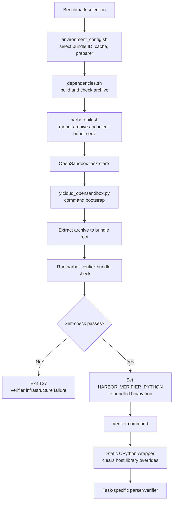

# Harbor Verifier Runtime

This directory contains reusable primitives for delivering an isolated Python
runtime to a verifier. It is intentionally separate from the shared
`Harbor/python_runtime.py`: that builder creates the Agent-side runtime and may
rely on system libraries, whereas this directory provides a verifier-side
runtime that is independent of the task image.

The directory itself is benchmark-agnostic. A task or benchmark may add a
child package that composes this runtime with its own verifier entrypoint,
self-check, and bundle name. The current repository has one such adapter,
`swe_rebench_v2_bundle_preparer/`; its SWE-rebench-V2 assumptions belong in
that child directory, not in this common layer.

## Design goals

A task image may have no Python, or may only provide a version that is too old
for a verifier. The common runtime primitive therefore has these invariants:

- CPython 3.12.14, Linux x86_64, built as a static musl runtime;
- no host Python, glibc, dynamic loader, or host LD_LIBRARY_PATH is copied;
- the runtime wrapper clears PYTHONPATH, LD_LIBRARY_PATH, and LD_PRELOAD before
  executing the bundled interpreter;
- static-runtime.json records the pinned source and wrapper digest;
- build-time and use-time checks verify the source digest, ELF type, wrapper,
  and required standard-library files;
- non-x86_64 hosts fail explicitly instead of silently falling back to image
  Python.

## File boundaries

| File | Responsibility |
| --- | --- |
| python_runtime.py | Reusable static Python runtime primitive: source resolution, ELF validation, and archive creation |
| swe_rebench_v2_bundle_preparer/ | SWE-rebench-V2-specific bundle composer and verifier self-check |
| swe_rebench_v2_bundle_preparer/README.md | SWE-rebench-V2 bundle layout, CLI, and self-check contract |

Task-specific environment code invokes its selected preparer through
`__main__.py`. The OpenSandbox provider receives the resulting tarball; it must
not select a Python version or mutate bundle contents.

## Injection and activation flow

The bundle is built on the Harbor runner and injected into the task Sandbox as
a read-only archive. The important activation point is the provider's command
bootstrap: it extracts the archive, runs the bundle self-check, and only then
allows the verifier command to start with `HARBOR_VERIFIER_PYTHON` pointing at
the bundled interpreter.

The archive mount is only the delivery mechanism; mounting it does not replace
the task image's `/usr/bin/python`. The command bootstrap is the runtime
injection point, and a failed extraction or self-check stops the verifier
before task grading begins. The task-specific child package owns the final
self-check and verifier entrypoint semantics.

## Current runtime policy

`python_runtime.py` currently exposes one pinned static-runtime policy through
`STATIC_SOURCE`. This is the common default for verifier runtimes today; it is
not a SWE-rebench-V2 requirement. If another verifier needs a different
interpreter policy, add a compatible runtime specification or a separate
runtime primitive at this layer, while keeping task-specific bundle assembly
in the child package.

The current source metadata is:

- release: 20260901;
- version: 3.12.14;
- target: x86_64-unknown-linux-musl;
- asset: cpython-3.12.14+20260901-x86_64-unknown-linux-musl-lto+static-full.tar.zst;
- SHA-256: 2b89d2b76515cd89007f6b7c7ef7a5b0815aa2ff871a1572324374b1a063f52a.

Preparation first checks <cache-dir>/cpython-verifier-static.tar.zst. The same
file may be supplied with `HARBOR_VERIFIER_PYTHON_SOURCE_ARCHIVE`. If neither
is available, `ARTIFACT_CACHE_GATEWAY_URL` is required; the source is downloaded
through the Artifact Cache Gateway and its digest is verified again. Direct
GitHub downloads through ambient proxies and unpinned URLs are not supported.

The generated static runtime is cached as
`<cache-dir>/python3.12-static-runtime.tar.gz`. A task-specific preparer then
composes the final verifier bundle and chooses its own bundle ID and output
path.

## Validation and failure semantics

`static_archive_ready()` rejects legacy dynamic runtimes, missing or modified
manifests, modified wrappers, non-x86_64 ELFs, ELFs containing PT_INTERP or
PT_DYNAMIC, and corrupt tarballs. Source resolution rejects a digest mismatch.
Preparation failure must stop the worker; a task-specific provider must not
fall back to the task image's Python. Bundle self-check behavior and bootstrap
logging are owned by each child preparer.

## Related documentation

- Current task-specific bundle: swe_rebench_v2_bundle_preparer/README.md
- Harbor structure: ../STRUCT.md

Common-runtime regression should cover a healthy image Python, missing Python,
an insufficient Python version, dynamic glibc/ABI incompatibility, and a
runtime self-check. Task-specific packages add their own parser or verifier
fixtures. Unit tests do not constitute an OpenSandbox smoke test.
